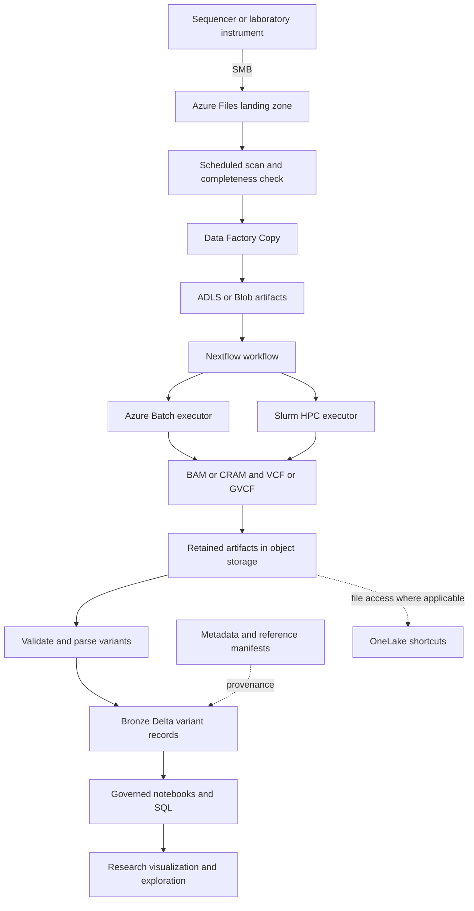

# Architecture

**Specified design, not deployed.** The goal is to preserve the laboratory's instrument configuration and folder conventions while adding storage staging, reproducible processing, and research analytics.

## Planned Data Flow

## Responsibilities

| Boundary | Planned responsibility |
|---|---|
| SMB landing zone | Accept instrument output using its existing paths; inventory arrival and completeness |
| Staging | Copy only complete files; compare integrity evidence; record source, destination, state, and lineage |
| Secondary analysis | Run one versioned Nextflow definition with Batch and Slurm profiles |
| Reference management | Resolve immutable reference manifests and verify build compatibility before compute starts |
| Variant store | Retain source artifacts while materializing validated variant records in Delta |
| Metadata | Relate research subjects, samples, runs, files, reference versions, and processing versions |
| Governance | Enforce access tiers, identity, classification, audit, and traceability |
| Analytics | Support research queries and visualizations without implying clinical determination |

## Decisions to Preserve

1. **Scheduled discovery on Azure Files.** The design uses a bounded directory scan and stability checks or a completion marker, rather than assuming a native file-created Event Grid notification for the SMB share.
2. **Copy and lifecycle are separate.** Data Factory Copy is the proposed Files-to-object-storage mover. Storage Actions is reserved for supported blob-side lifecycle operations after landing, not for copying out of a file share.
3. **File artifacts and variant rows are different assets.** OneLake shortcuts can expose retained object-storage files in the applicable deployment. Parsed variant rows are physically materialized in Delta; a shortcut does not parse a VCF.
4. **Fine-grained provenance belongs in records and metadata.** Purview is the proposed coarse-grained catalog and lineage surface, not the source of variant-level lineage.
5. **Executor equivalence means concordance.** Batch and Slurm results are to be assessed with GATK `Concordance` against a truth set. Bit-for-bit identity is not promised.
6. **Reference builds are immutable.** Checksums, versioned manifests, and compatibility preflight are required before processing.

The proposed object-storage taxonomy is `Ingest`, `Process`, `Failed`, `External`, `Inventory`, `ReferenceData`, and `SampleData`, with genomics modality subfolders. These are downstream storage conventions, not a requirement to rename the laboratory's existing instrument folders.

## Workload Context

The [sourced genomics workload note](https://github.com/samueltauil/genomics-variant-analytics/blob/docs/project-wiki/docs/genomics-workload-context.md) captures the SPECstorage Solution 2020 User's Guide v1.2, reviewed 2026-09-10. The supplied PDF is not the SFS 2014 SP2 guide. The note is published on the documentation branch pending review, not yet on `main`.

The guide's GENOMICS profile models whole-workflow storage behavior: 72% read, 9% write and 19% metadata operations by application-level operation count. This supports investigating read concurrency, shared references, scratch writes and small-file/metadata pressure in secondary analysis. It is not a per-stage trace of this accelerator, and synthetic JOBS cannot be converted into genomes, storage-service IOPS, resource sizes or cost per sample.

Landing remains an ingestion boundary, with the existing 100 GiB sequential SMB write and provisioned-IOPS acceptance criteria unchanged. Future mixed-I/O tests would need calibration against the selected Nextflow workflow, with cache, working-set and data-reduction assumptions recorded. Delta query performance and scientific concordance require separate evaluations. The local repeated-buffer write harness is only a smoke test. No benchmark was run, no SPEC result is claimed, no task was completed by this context update, and Azure operations remain paused.

## Unresolved Choices

The reference deployment's Delta engine, Fabric versus Databricks, is not selected. Whether annotation ships as a pipeline step or arrives in input VCFs is also open. Query performance, physical table layout, sizing, and cost must be measured during implementation; the diagram is not evidence that targets are met.

## Sources

- [Design decisions and supporting platform references](https://github.com/samueltauil/genomics-variant-analytics/blob/main/openspec/changes/add-genomics-variant-accelerator/design.md)
- [Capability specifications](https://github.com/samueltauil/genomics-variant-analytics/tree/main/openspec/changes/add-genomics-variant-accelerator/specs)
- [Known limitations](https://github.com/samueltauil/genomics-variant-analytics/blob/main/docs/limitations.md)
- [Data Model and Provenance](Data-Model-and-Provenance)