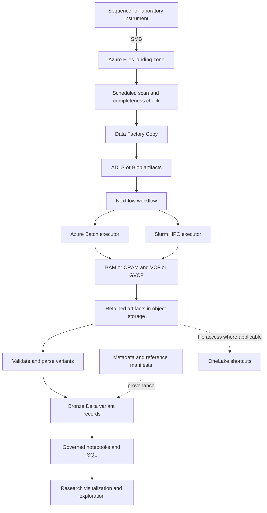

# Architecture

**Ingestion and staging have measured Azure evidence, and the current tagged foundation passed its private storage-path checks; processing, the variant store, metadata, governance, and analytics still use local synthetic reference implementations rather than deployed services.** The goal is to preserve the laboratory's instrument configuration and folder conventions while adding storage staging, reproducible processing, and research analytics.

## Planned Data Flow

## Responsibilities

| Boundary | Planned responsibility |
|---|---|
| SMB landing zone | Accept instrument output using its existing paths; inventory arrival and completeness |
| Staging | Copy only complete files; compare integrity evidence; record source, destination, state, and lineage |
| Secondary analysis | Run one versioned Nextflow definition with Batch and Slurm profiles |
| Reference management | Resolve immutable reference manifests and verify build compatibility before compute starts |
| Variant store | Retain source artifacts while materializing validated variant records in Delta |
| Metadata | Relate research subjects, samples, runs, files, reference versions, and processing versions |
| Governance | Enforce access tiers, identity, classification, audit, and traceability |
| Analytics | Support research queries and visualizations without implying clinical determination |

## Decisions to Preserve

1. **Scheduled discovery on Azure Files.** The design uses a bounded directory scan and stability checks or a completion marker, rather than assuming a native file-created Event Grid notification for the SMB share.
2. **Copy and lifecycle are separate.** Data Factory Copy is the proposed Files-to-object-storage mover. Storage Actions is reserved for supported blob-side lifecycle operations after landing, not for copying out of a file share.
3. **File artifacts and variant rows are different assets.** OneLake shortcuts can expose retained object-storage files in the applicable deployment. Parsed variant rows are physically materialized in Delta; a shortcut does not parse a VCF.
4. **Fine-grained provenance belongs in records and metadata.** Purview is the proposed coarse-grained catalog and lineage surface, not the source of variant-level lineage.
5. **Executor equivalence means concordance.** Batch and Slurm results are to be assessed with GATK `Concordance` against a truth set. Bit-for-bit identity is not promised.
6. **Reference builds are immutable.** Checksums, versioned manifests, and compatibility preflight are required before processing.

The proposed object-storage taxonomy is `Ingest`, `Process`, `Failed`, `External`, `Inventory`, `ReferenceData`, and `SampleData`, with genomics modality subfolders. These are downstream storage conventions, not a requirement to rename the laboratory's existing instrument folders.

## Deployed Environment and Platform Constraints

A disposable environment was deployed into a sandbox subscription on 2026-09-10/11, remained in place while later tasks were exercised against it, and was fully torn down on 2026-09-18. A separate tagged resource group, `rg-genomics-20260919`, was then created in `eastus2` with an October 3, 2026 expiry tag. Identities, storage accounts, private endpoints, Data Factory, the Storage Actions task definition, an admin-disabled ACR, and a verification VM exist. The private storage acceptance checks passed, the OIDC release workflow pushed an attested image to ACR, and the VM was deallocated on September 19, 2026. The Storage Actions transition and private governed query path remain incomplete. The subscription policies are ordinary for a governed tenant and shaped the design more than any preference did. Treat them as likely in customer environments rather than as local quirks.

| Observed constraint | Consequence for the design |
|---|---|
| `publicNetworkAccess` forced to `Disabled` on storage accounts | Both data planes are reachable only through private endpoints. Any client, including the staging service, must sit inside the network. |
| `allowSharedKeyAccess` forced to `False` | No storage account key exists. SMB cannot use NTLMv2, and every data-plane caller authenticates as a managed identity. |
| Public IP addresses cannot be created | NAT Gateway, Azure Firewall and VM public addresses are unavailable. Administration runs through the control plane rather than inbound access. |
| Limited VM families available in the region | Verification compute must be selected from what the region actually offers, not from a fixed size. |
| Blob versioning unsupported on hierarchical-namespace accounts | Reference immutability cannot rely on blob versions; it needs write-once containers plus checksummed manifests. |

### Identity-based SMB is the landing-zone contract

Because no account key exists, the share uses **SMB OAuth with a managed identity**: the account sets `azureFilesIdentityBasedAuthentication.smbOAuthSettings.isSmbOAuthEnabled`, the ingestion identity holds **Storage File Data SMB MI Admin**, and Linux clients mount with `sec=krb5` after the `azfilesauth` package obtains a ticket from the instance metadata service. No domain join is required.

Two details cost real time and are worth carrying forward. The setting is **nested under `azureFilesIdentityBasedAuthentication`**, not at the top of `properties`; a top-level write returns success and is silently ignored. It also requires storage API version `2025-08-01` or later.

A 100 GiB sequential write over this mount sustained **240 MiB/s** against a provisioned 200 MiB/s ceiling, with the share reporting its provisioned 3000 IOPS.

### Staging authenticates the same way

Data Factory's Azure Files connector supports user-assigned managed identity, so the Copy pipeline needs no key either. It runs in a managed virtual network with managed private endpoints, reads the share as the **ingestion** identity and writes object storage as the **staging** identity, which keeps landing-zone access restricted to the identity that owns it.

## Workload Context

The [sourced genomics workload note](https://github.com/samueltauil/genomics-variant-analytics/blob/main/docs/genomics-workload-context.md) captures the SPECstorage Solution 2020 User's Guide v1.2, reviewed 2026-09-10. The supplied PDF is not the SFS 2014 SP2 guide.

The guide's GENOMICS profile models whole-workflow storage behavior: 72% read, 9% write and 19% metadata operations by application-level operation count. This supports investigating read concurrency, shared references, scratch writes and small-file/metadata pressure in secondary analysis. It is not a per-stage trace of this accelerator, and synthetic JOBS cannot be converted into genomes, storage-service IOPS, resource sizes or cost per sample.

Landing remains an ingestion boundary. Task 1.3's 100 GiB sequential SMB write and provisioned-IOPS criteria have now been measured on the deployed share; the SPEC profile played no part in that result. Future mixed-I/O tests would need calibration against the selected Nextflow workflow, with cache, working-set and data-reduction assumptions recorded. Delta query performance and scientific concordance require separate evaluations. No SPEC benchmark was run and no SPEC result is claimed.

## Unresolved Choices

The reference deployment's Delta engine, Fabric versus Databricks, is not selected. Whether annotation ships as a pipeline step or arrives in input VCFs is also open. Query performance, physical table layout, sizing, and cost must be measured during implementation; the diagram is not evidence that targets are met.

## Sources

- [Design decisions and supporting platform references](https://github.com/samueltauil/genomics-variant-analytics/blob/main/openspec/changes/add-genomics-variant-accelerator/design.md)
- [Capability specifications](https://github.com/samueltauil/genomics-variant-analytics/tree/main/openspec/changes/add-genomics-variant-accelerator/specs)
- [Known limitations](https://github.com/samueltauil/genomics-variant-analytics/blob/main/docs/limitations.md)
- [Data Model and Provenance](Data-Model-and-Provenance)
